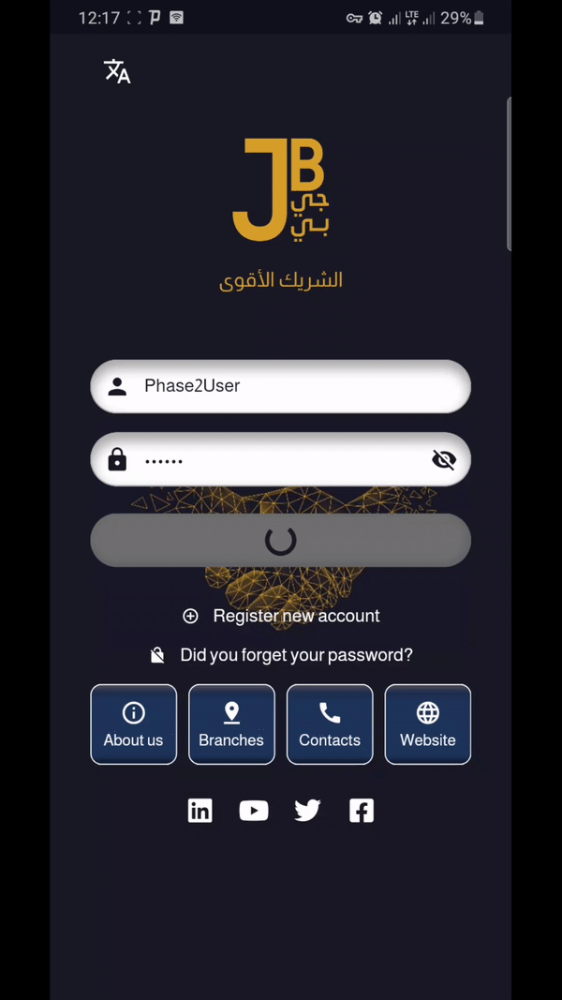
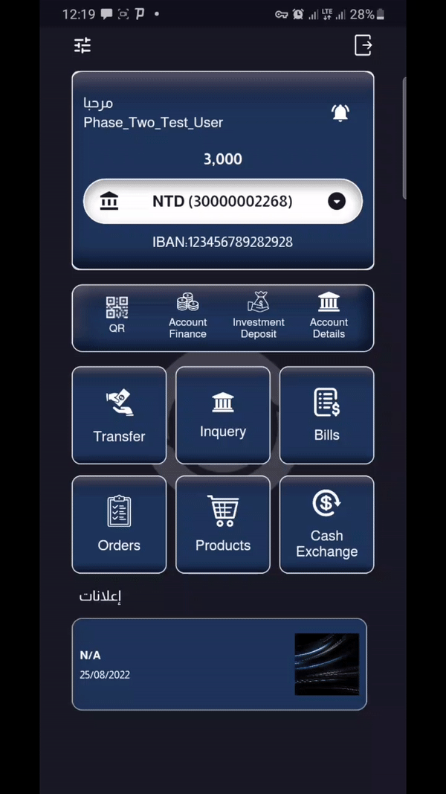
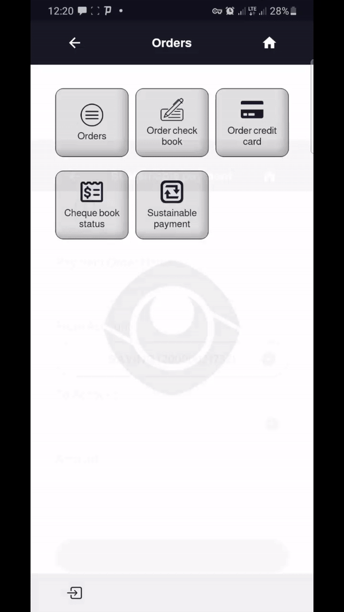

# JB Bank

 JB Bank App is a mobile banking application for Al Jazira Sudanese Jordanian Bank.

 Application phase 1 [AndroidApp](https://play.google.com/store/apps/details?id=com.trustpay.jsb).

  Application phase 2 .

## Contribution

- Developed, tested, and designed application architecture.
- Managed application lifecycle from development to deployment
- External resource UI/UX

## Tech stack

<svg width='56' height='56' style="filter: invert(21%) sepia(98%) saturate(1528%) hue-rotate(189deg) brightness(95%) contrast(98%)"  role="img" viewBox="0 0 24 24" xmlns="http://www.w3.org/2000/svg"><path d="M14.314 0L2.3 12 6 15.7 21.684.013h-7.357zm.014 11.072L7.857 17.53l6.47 6.47H21.7l-6.46-6.468 6.46-6.46h-7.37z"/></svg>  <svg  role="img" width='56' height='56' style="margin-left:10px;filter: invert(28%) sepia(57%) saturate(5060%) hue-rotate(188deg) brightness(94%) contrast(99%)" viewBox="0 0 24 24" xmlns="http://www.w3.org/2000/svg"><path d="M4.105 4.105S9.158 1.58 11.684.316a3.079 3.079 0 0 1 1.481-.315c.766.047 1.677.788 1.677.788L24 9.948v9.789h-4.263V24H9.789l-9-9C.303 14.5 0 13.795 0 13.105c0-.319.18-.818.316-1.105l3.789-7.895zm.679.679v11.787c.002.543.021 1.024.498 1.508L10.204 23h8.533v-4.263L4.784 4.784zm12.055-.678c-.899-.896-1.809-1.78-2.74-2.643-.302-.267-.567-.468-1.07-.462-.37.014-.87.195-.87.195L6.341 4.105l10.498.001z"/></svg>  

- Flutter and dart.
- Bloc for state management.
- Bloc provider for dependency injection.
- Dio Network Services.
- Hive for local storage.
- Az-consumer package for card services.

## Application Services

- Register with a credit card.
- Register with the bank account number.
- Banking information
- Balance inquiry.
- Bank transactions, own account transfer, other account transfers..etc.
- Account statement, minimum statement of account, periodic statement, download statement.
- Bank products.
- Customer requests such as checkbook requests, check status, credit card requests, and status.
- Manage standing payment orders.
- exchange rate
- Beneficiary management.
- Multi-Language support.
- Ads panel.
- Push notifications.
- QR transfer.
- Telecom Services post and prepaid services.
- E-government services billing, and bill payment.

And many other services.

<h3>Login</h3>

<h3>Transactions</h3>

<h3>Cash exchange - Bank products</h3>

<h3>User Orders</h3>

<h3>Sustainable Payments</h3>

<h3>Settings</h3>

<h3>Statement</h3>

