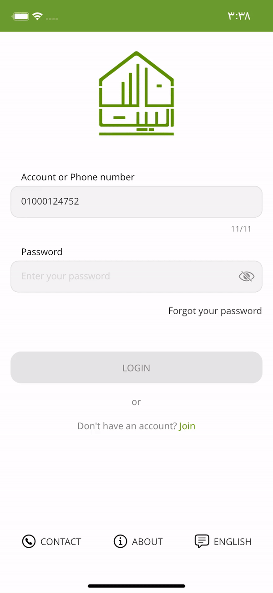

# Nasalbait

 Farmers commercial bank mobile application. application is under development.
New Application url:
Old application google play url: [Nasalbit](https://play.google.com/store/apps/details?id=com.fcb.mobile)

## Contribution

- Rebranding and re-engineering Nasalbait app to cross-platform applications.
- Developed, tested, and designed application architecture.
- Designed UI/UX for application.

## Tech stack

  

- Flutter and dart.
- Bloc for state management.
- Bloc provider for dependency injection.
- Dio Network Services.
- Hive for local storage.
- Az-consumer package for card services.
  
## Services

- Registration by creditcard.
- Login.
- Main content which contains  balance,  user accounts, and a list of favorite services.
- Bank Services for example account to account transfer, electricity bill payment, account to card transfer ..etc.
- Transaction history.
- Multi-language support.
- Beneficiary management.

 and many other services.

## Application Rebranding screenshot

<h3>Account Login</h3>

<h3>Account Tabs Preview</h3>

<h3>Account Transfer </h3>

<h3>Account Services </h3>

<h3>Favorite Management & Settings </h3>

## Card Services Screens 

<h3>Card User Registeration </h3>

<h3>Card User Login </h3>

<h3>Card Main Preview </h3>

<h3>Card Balance Inquery </h3>

<h3>Card Services </h3>

<h3>Transaction History</h3>

<h3>Card Favorite</h3>

