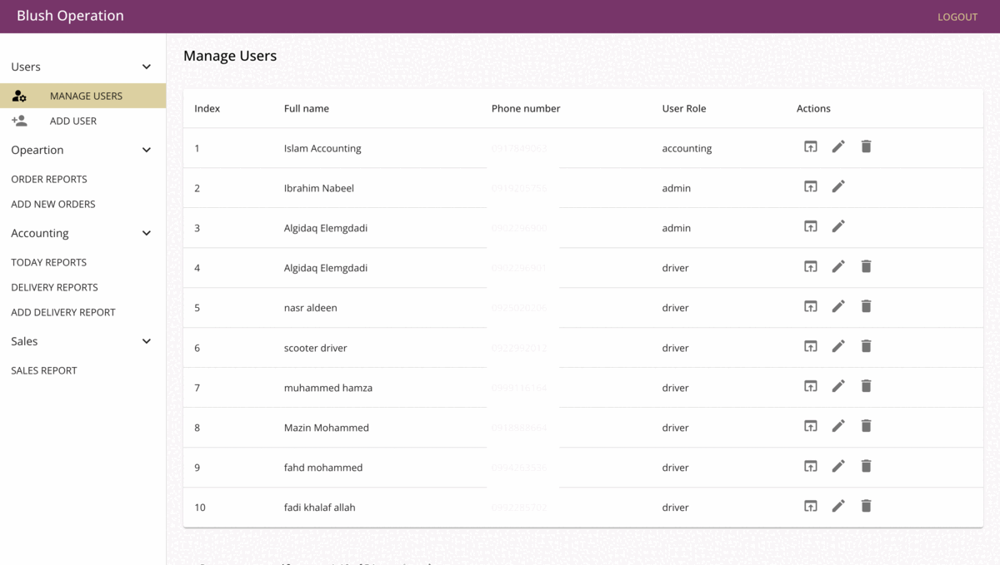

# Blush Dashboard

It’s an operational, accounting, and managerial dashboard for managing orders, orders reports, sales reports, and delivery man.

## My Contribution

- Analysis, design, development, and deployment of web API.
- Analysis, design, development, and deployment of web app.

## Tech stack

- Backend and API Development:
  - Typescript and nodejs
  - Express-js.
  - Typeorm.
  - Joi.
- Frontend:
  - Javascript.
  - React-js.
  - Material-ui.
  - Axios.
  - Formik.

## Services 

- User management:
  - Displays user information name, role, phone ..etc.
  - Edit user information.
  - Add new user.
  - Delete user or deactivated.
- Report management:
  - Displays reports information sorted by date total orders, assigned orders, unassigned orders removed orders.
  - Report detail displays information about report and associated delivery man and their reports.
  - Add Report.
- Delivery reports displays accounting information about completed orders by delivery man mobile application.
- Sales reports displays account information about total delivery reports.

## Preview

