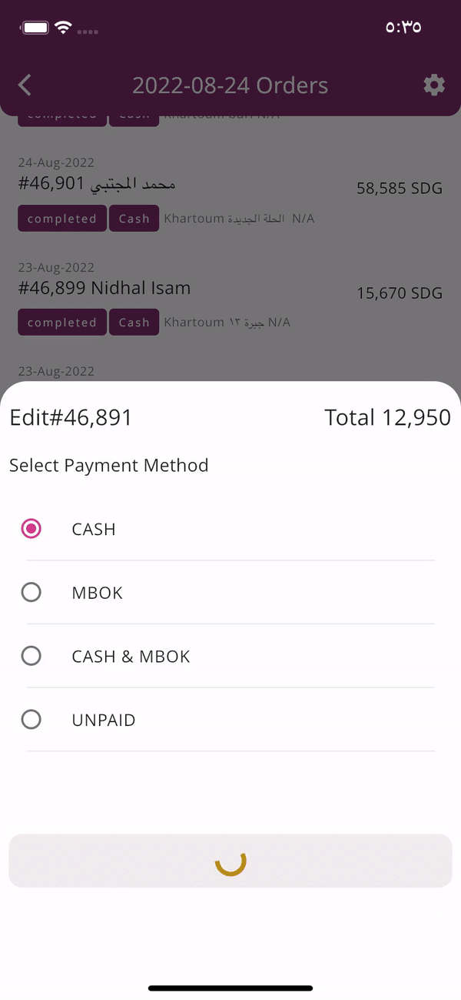

# Deliveryman mobile application

An internal application for delivery man to display their assigned orders by operation manager. With detailed information about the order.

## My Contribution

- Developed, tested, and designed application architecture.
- Managed application lifecycle from development to deployment.

## Tech stack

<svg width='56' height='56' style="filter: invert(21%) sepia(98%) saturate(1528%) hue-rotate(189deg) brightness(95%) contrast(98%)"  role="img" viewBox="0 0 24 24" xmlns="http://www.w3.org/2000/svg"><path d="M14.314 0L2.3 12 6 15.7 21.684.013h-7.357zm.014 11.072L7.857 17.53l6.47 6.47H21.7l-6.46-6.468 6.46-6.46h-7.37z"/></svg>  <svg  role="img" width='56' height='56' style="margin-left:10px;filter: invert(28%) sepia(57%) saturate(5060%) hue-rotate(188deg) brightness(94%) contrast(99%)" viewBox="0 0 24 24" xmlns="http://www.w3.org/2000/svg"><path d="M4.105 4.105S9.158 1.58 11.684.316a3.079 3.079 0 0 1 1.481-.315c.766.047 1.677.788 1.677.788L24 9.948v9.789h-4.263V24H9.789l-9-9C.303 14.5 0 13.795 0 13.105c0-.319.18-.818.316-1.105l3.789-7.895zm.679.679v11.787c.002.543.021 1.024.498 1.508L10.204 23h8.533v-4.263L4.784 4.784zm12.055-.678c-.899-.896-1.809-1.78-2.74-2.643-.302-.267-.567-.468-1.07-.462-.37.014-.87.195-.87.195L6.341 4.105l10.498.001z"/></svg>  

- Flutter and dart.
- Bloc for state management.
- Bloc provider for dependency injection.
- Dio Network Services.
- Hive for localstorage

## Services

- Reports screen displays information about user reports date, total orders, completed and uncompleted orders, and percentage progress of order completion.
- Report screen display stats about the report and list of orders with information about the order customer name, order status, shipping address, and order total.
- Notify customer before arrival.
- Adding notes.
- Direct call to customer.
- Ability to reorder orders base on delivery man preference.
- Order details.
- Multi-language support.

## Application Screens

<h3>Login Screen </h3>

<h3>Reports View </h3>

<h3>Report Details </h3>

<h3>Order Details </h3>

